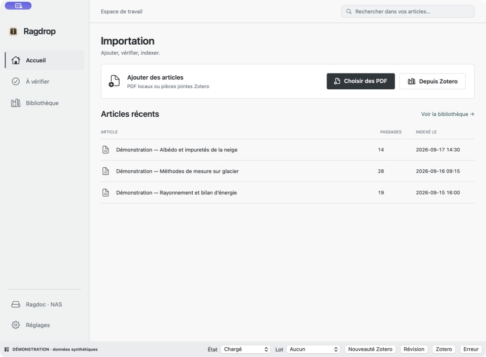
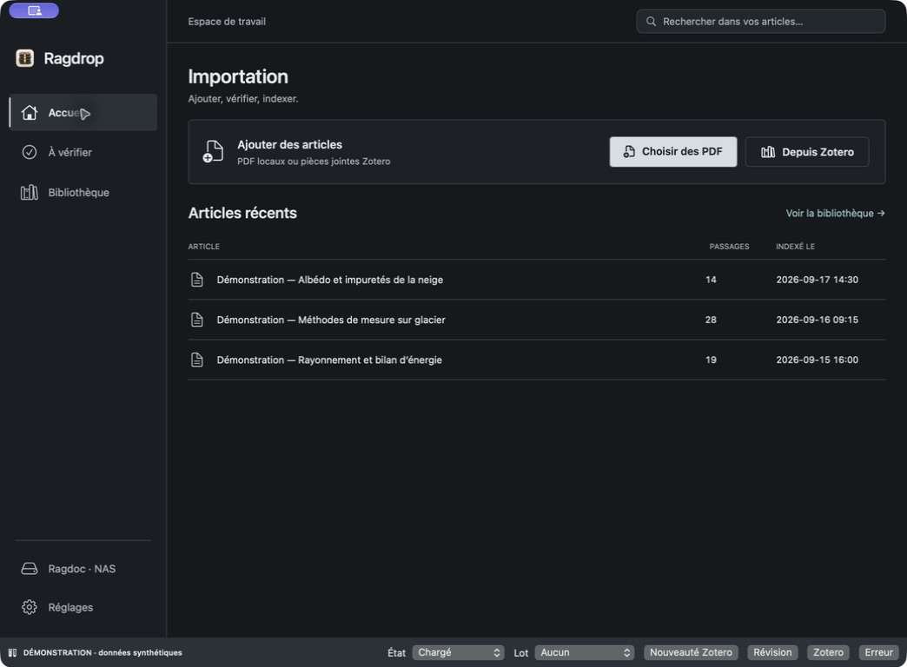
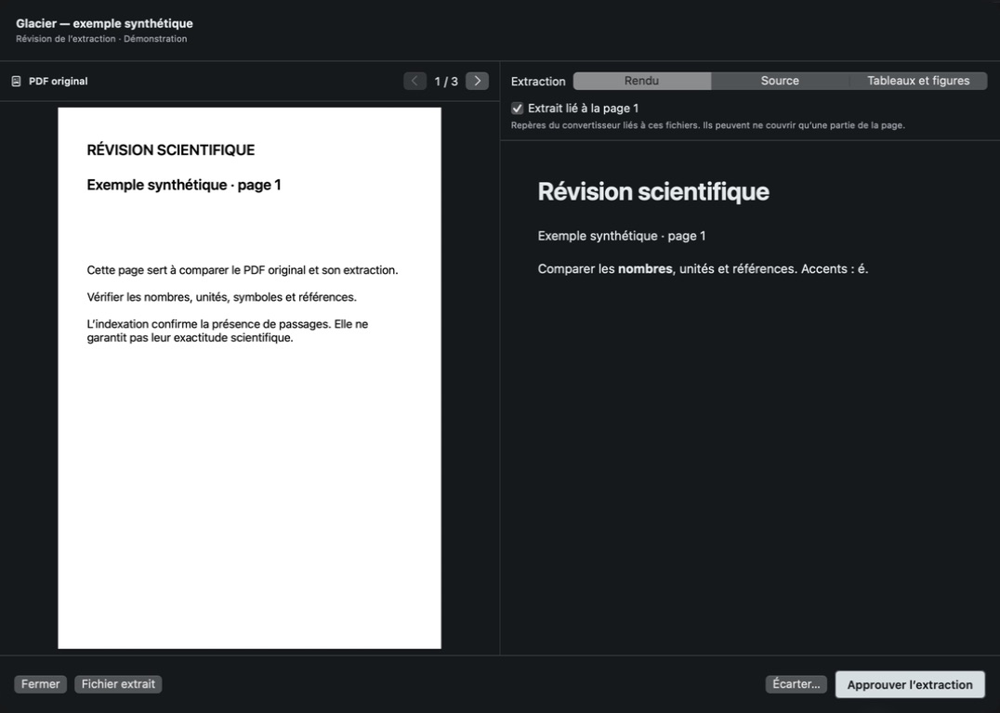
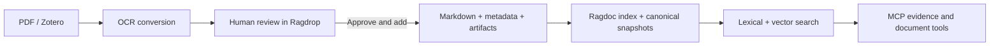

# Ragdoc + Ragdrop

**Review scientific PDFs on your Mac. Search the resulting library with traceable passages through MCP.**

Ragdrop is the macOS application for importing PDFs, comparing extracted text with
its source, and approving documents for indexing. Ragdoc is the backend that stores
the library and exposes search, document reading and evidence tools to MCP clients.

*Actual Ragdrop interface, shown with original synthetic examples. The current app
uses French labels. The demonstration controls along the bottom are not part of
the normal app.*

## What you can do

- **Bring in PDFs from Finder or Zotero.** Queue several articles and detect
  duplicates using PDF fingerprints.
- **Review before indexing.** Compare the original PDF with rendered extraction,
  Markdown source, and extracted tables or figures. Follow page links when the
  conversion provides matching locators.
- **Keep track of each article.** Conversion, human review, transfer, indexing and
  verification remain distinct; failures and pending decisions stay visible.
- **Search beyond exact wording.** Ragdoc combines lexical and vector retrieval,
  with optional reranking, source filters and structured evidence results.
- **Read the supporting context.** Retrieve passages and canonical document
  snapshots with version hashes and provenance coverage rather than relying on a
  search snippet alone.

## See the workflow

*Human review is a separate step. Approval makes an extraction eligible for
indexing; successful indexing does not certify its scientific accuracy.*

Dark appearance

Ragdrop offers **light, dark and system** appearance under **Réglages → Apparence**.
See [screenshot provenance and reproduction](docs/assets/ragdrop/README.md).

## Try it

| Your goal | Start here |
|---|---|
| Explore the macOS interface without a backend or API keys | [Build the isolated synthetic demo](Ragdrop/README.md#try-the-interface) |
| Build Ragdrop and connect your own backend | [macOS application guide](Ragdrop/README.md) |
| Run the search backend or connect an MCP client | [Backend installation](INSTALLATION.md) |
| Understand provenance, migration and evaluation | [Scientific reliability guide](docs/SCIENTIFIC_RELIABILITY.md) |

**This is currently a source-build project, not a one-click installation.** Ragdrop
requires macOS 14 or later and Swift 6.2 to build. Real imports need a configured
SSH-accessible Linux backend and an OCR service credential. Build from source; a notarized macOS download is not available yet. The demo works without those services.

## What runs where

Ragdrop reads local PDFs and the Zotero Desktop local API. Mistral OCR is the default
converter; MinerU is an alternative. These converters upload selected PDFs to their
respective services **before** the human review step. Approved Markdown, metadata
and visual artifacts are transferred to your backend over SSH.

Ragdoc stores Chroma vectors, a SQLite FTS5 lexical index and versioned Markdown
snapshots on your infrastructure. Voyage AI receives document text during embedding
and queries during semantic search. Cohere, when configured, receives the query and
candidate passages for reranking. Your MCP client receives the retrieved content;
its own model and data handling are separate from Ragdoc.

Lexical retrieval and canonical reads can run locally once the library is indexed.
With `alpha=0`, search skips Voyage; to avoid reranking API calls, leave Cohere
unconfigured too. Building a new vector index uses Voyage. Model identifiers and
configuration are described in the [backend guide](INSTALLATION.md#configuration).
Storage and indexes stay on your infrastructure; OCR, embeddings and optional
reranking use the services listed above.

## Trust and limitations

- OCR can lose or misread equations, table structure, units and reading order.
  Check the PDF before relying on extracted content.
- An exact match to a canonical snapshot establishes textual provenance, not
  scientific truth or correct OCR. PDF page links depend on available, verified
  locator coverage and may be missing.
- Search scores rank candidates; they are not confidence probabilities. No result
  does not establish that evidence is absent from the literature.
- Evaluation tooling separates human-reviewed judgments from provisional assistant
  diagnostics. Current diagnostics do not establish a general retrieval-quality
  score. See the
  [evaluation requirements](docs/SCIENTIFIC_RELIABILITY.md#evaluation).
- Back up source Markdown, canonical snapshots and the index before migration.
  Index replacement has recovery checks, but is not a database-wide transaction.

## Development and contributions

See [CONTRIBUTING.md](CONTRIBUTING.md) for offline checks and contribution scope.
Useful next steps include simpler backend onboarding, broader extraction tests,
accessibility, and language support. Use original synthetic documents in issues
and tests; do not commit articles, personal libraries, credentials or generated
indexes.

[MIT license](LICENSE). Service credentials and any rights needed to process your
own documents remain your responsibility.
