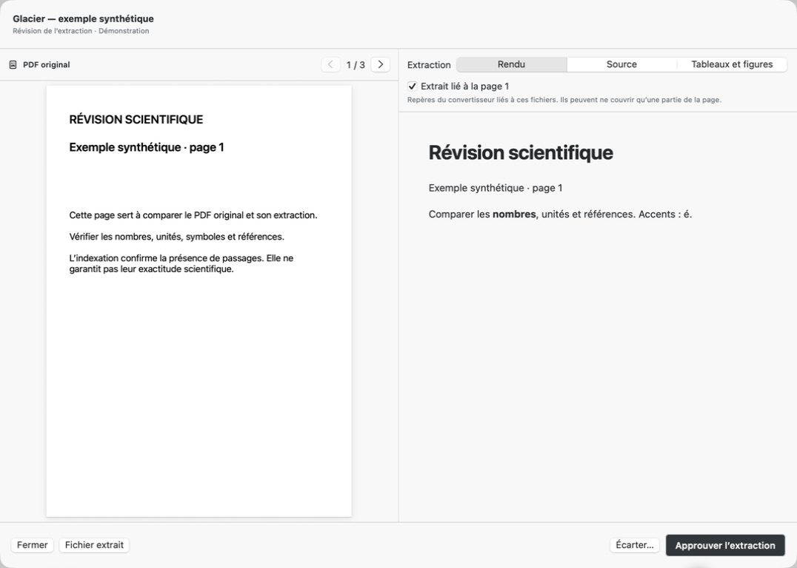

# Ragdrop for macOS

Ragdrop is the desktop intake and review application for [Ragdoc](../README.md).
Import local or Zotero PDFs, compare extraction with the source, approve or reject
it, then add approved documents to your search library. The interface currently
uses French labels and supports light, dark and system appearance.



## Try the interface

Requirements: macOS 14+, a Swift 6.2 toolchain with the macOS SDK and command-line
build tools. From a checkout of this branch:

```sh
cd Ragdrop
./script/build_theme_demo.sh
open 'dist/Ragdrop Theme Validation.app'
```

The first command only builds; `open` explicitly launches the separate demo app.
It uses generated example PDFs, simulated progress and isolated preferences. It
does not read your real queue, call OCR, contact your NAS or import your library.
Use its bottom strip to explore review, error and progress states. You can try
this before setting up any backend or service credentials.

## Build the normal app

```sh
cd Ragdrop
swift test
./script/build_and_run.sh build
```

The bundle is written to `Ragdrop/dist/Ragdrop.app` relative to the repository root.
The explicit **`build` argument is important**: omitting it launches the app and
stops an existing Ragdrop process. The `--verify` mode also launches it; it is not
an offline check. The commands above do not install or launch the normal app.

The bundle is signed locally with an ad-hoc signature. There is no notarized
release/download supplied here. Build on the Mac where you intend to use it;
installation into Applications is a separate manual step. SwiftPM has no external
Swift dependencies; the bundle includes the icon and Python converter scripts.

## Set up real imports

Ragdrop currently expects an SSH-accessible **Linux backend** with a specific
layout. A NAS is one possible host. This setup is not automated by the app.

1. Follow the [backend installation guide](../INSTALLATION.md#ragdrop-backend-layout)
   for the required interpreter, collection, directories and local MCP listener.
2. Configure an SSH alias such as `ragdoc-server` in `~/.ssh/config`, with a user,
   host and key appropriate to your server. Test it from Terminal first, accepting
   the host key deliberately and ensuring no password prompt is needed. The app's
   host field accepts an alias, not `user@host`.
3. In **Réglages → Fonctionnement**, set **NAS** and **Dossier Ragdoc** to your own
   alias and absolute backend root. `ragdoc-server` and `/srv/ragdoc` are example
   defaults, not a supplied service. Paths currently allow letters, numbers,
   underscores, hyphens, dots and slashes, but no spaces.
4. Install Python 3.10+ and `requests` for the interpreter found by the app. The
   converter runs `python3` using the fixed PATH
   `/opt/homebrew/bin:/usr/local/bin:/usr/bin:/bin:/usr/sbin:/sbin`, **not** the
   backend virtual environment or an activated terminal environment. One option
   is a dedicated virtual environment whose `python3` you expose at a location on
   that PATH; do not overwrite an existing interpreter. Verify `import requests`
   with that exact interpreter. Python is not bundled with Ragdrop.
5. Add a Mistral key in **Réglages → Mistral OCR**; the app saves it to the macOS
   Keychain. Choose **MinerU (secours)** only if configured with your own
   `~/.mineru_token`. The MinerU converter also needs `curl` and either `qpdf` or the Python
   `pypdf` package to count pages for every PDF and split long PDFs. Both providers receive
   selected PDF content and may charge for processing.
6. For Zotero import, run Zotero Desktop with its local API available on
   `127.0.0.1:23119`. PDF attachments must be downloaded and readable on this Mac.
   Ragdrop reads the library; it does not modify Zotero records. Optional
   **Surveiller Zotero** monitoring is off by default and proposes new PDFs for
   selection; it does not bypass review.

## Use the application

1. Choose **Choisir des PDF**, drop files, or select attachments through
   **Depuis Zotero**. Conversion can send PDF content to the selected OCR provider.
2. Open **À vérifier**. Compare **PDF original** with **Rendu**, **Source**, and
   **Tableaux et figures**. Linked pages are available only when file hashes and
   conversion locators match; incomplete coverage is shown explicitly.
3. **Approuver l’extraction** marks the document ready for indexing; **Écarter**
   rejects it. Approval and transfer are separate actions.
4. Add the approved documents. Ragdrop transfers Markdown, metadata and artifacts,
   indexes the approved sources as a batch, then checks that each has stored
   passages. The counter advances after that check, not after OCR alone.
5. Use **Bibliothèque** for the indexed catalogue. Semantic/evidence search is
   available through the Ragdoc MCP backend in your chosen client; the desktop
   search field filters the catalogue.

The app retains its queue under `~/Library/Application Support/Ragdrop/`.
Conversion artifacts are temporary until transferred; source PDFs remain in their
original location. Metadata can contain the source PDF's local path and Zotero
identifiers, so treat backend sidecars as private library data too.

**Ragdoc · NAS** runs a live diagnostic, including a semantic search and reranking
when configured. It can make billable API requests; it is not the offline
`--check-runtime` check described in the backend guide.

## Limitations

The backend path, environment name, collection and expected embedding model are
currently coupled to the layout documented in the guide. The app does not provision
SSH, Python, Chroma or API credentials on your server. Do not point it at an existing
collection using a different embedding model; follow the migration guide first.

OCR and page mapping need human inspection. Confirming indexed passages is not a
scientific validation. Changing appearance may reload the extraction HTML and reset
its scroll position; it does not rerun OCR. The original PDF keeps its own colors.
